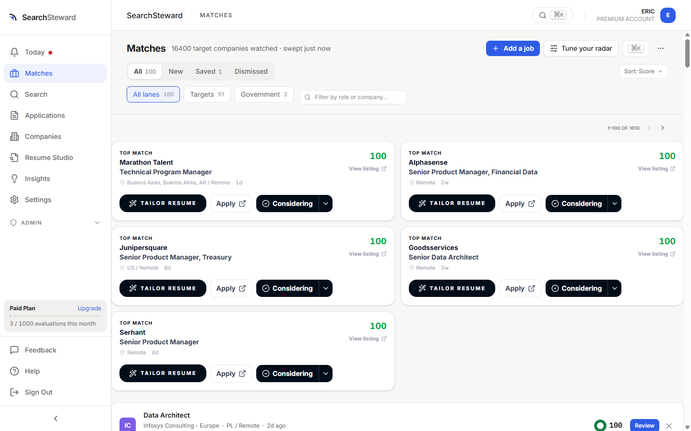
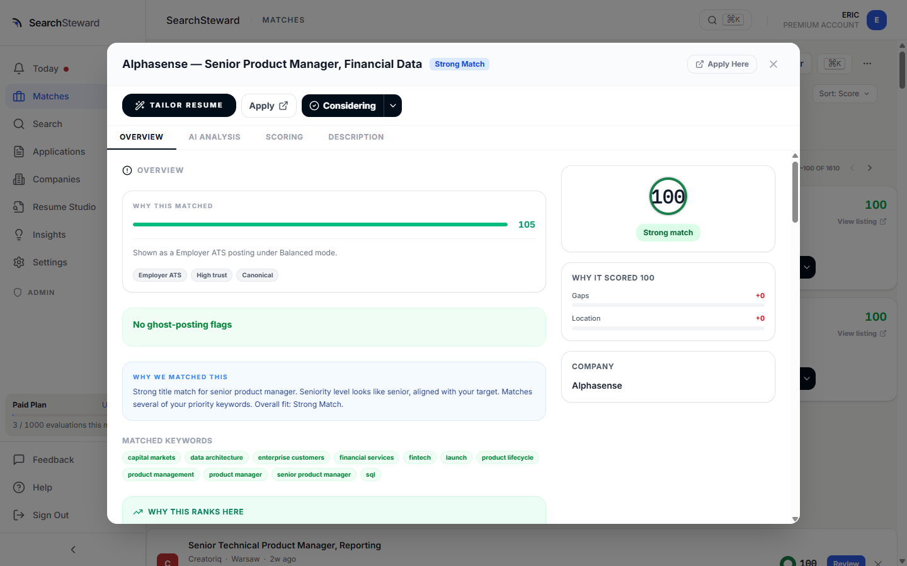
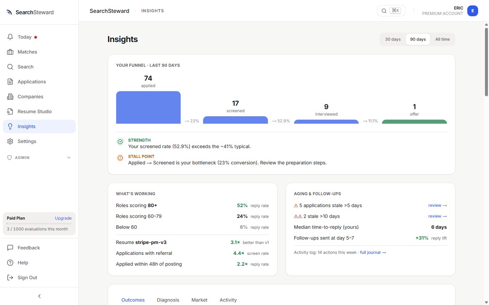
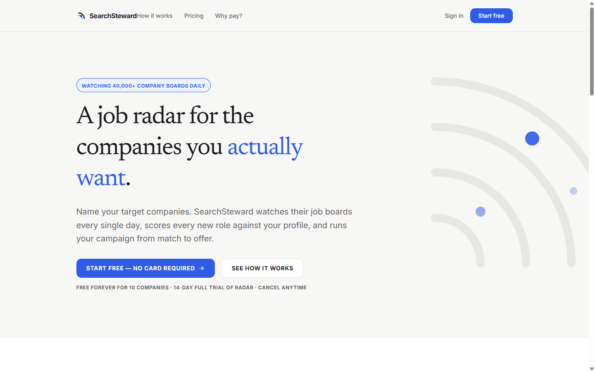

# SearchSteward

**A job-search radar that watches company career pages for you.**
Official site: **[searchsteward.com](https://searchsteward.com)**

SearchSteward is a proactive job-search tool. Instead of scrolling job boards,
it monitors **40,000+ company career pages** directly and scores every new
opening against your résumé the day it's posted — so well-matched roles find
you, not the other way around.

This repo is the developer face of the product: what it looks like, how it's
built at a high level, and an index of the parts of the engine we open-source.

## What it does

- **Career-page radar** — tracks tens of thousands of employer career pages
  daily and surfaces new, on-target roles as they appear.
- **AI résumé ↔ role scoring** — every opening scored against your background,
  with the matched keywords and the *why* shown, not just a number.
- **Ghost Job Detector** — flags stale, perpetually-reposted, or never-filled
  listings *at the source*, so you don't waste applications. Because we pull
  straight from company career pages — not aggregators, where ghost jobs pile
  up — we know when a listing first appeared and how it left.
- **Application tracking & insights** — keep every role and its status in one
  place, and see where your funnel actually stalls.

## A quick tour

**Matches, scored and explained.** Every role gets a fit score against your
résumé and search settings, with lanes for your target companies:

**Every score shows its work.** Click into any match: the score breakdown,
matched keywords, ranking rationale — and the ghost-posting check — are all
visible:

**Your funnel, diagnosed.** Insights shows conversion at each stage, which
résumé version is out-performing, and where applications are going stale:

**The front door:**

## Open source at SearchSteward

We open-source the pieces where **transparency is the feature** — the code
that reads, checks, and classifies job postings on your behalf. If a tool
filters jobs by salary or flags a listing as a ghost job, you deserve to see
exactly how it decides. Everything below is MIT-licensed, dependency-free,
and the same code running in production.

| Repository | What it is | Language |
|---|---|---|
| **[resume-match](https://github.com/searchsteward/resume-match)** | The engines behind our free, no-signup tools: `scoreMatch()` (résumé ↔ JD keyword-coverage scoring) and `checkGhostJob()` (scam/ghost-posting checklist). Runs entirely in your browser — pasted text never leaves the page, and publishing the source is how we back that claim. | TypeScript |
| **[ghost-signal](https://github.com/searchsteward/ghost-signal)** | The production decision logic behind the in-app ghost-job badge. Deliberately conservative: absence of evidence yields `unknown`, never `clean`, and every tier carries its reasons. Every signal and weight is documented. | Python |
| **[salary-parser](https://github.com/searchsteward/salary-parser)** | Extracts real salaries from posting text without fabricating them. A naive regex reads *"10-15 hours per week"* as $20,800 a year; this is the context-gated, cadence-aware extractor that doesn't. 86 tests, most of them real-posting regressions. | Python |
| **[location-parser](https://github.com/searchsteward/location-parser)** | Parses the location strings job boards *actually* emit — Workday req-id suffixes, Greenhouse dict leaks, trailing ZIPs, `"Mexico, Remote"` vs bare `"Remote"` — into structured city/state/country + remote components. | Python |

Each library lives in its own repository with its own tests, README, and
issue tracker. They're small on purpose: one job each, zero dependencies,
easy to vendor.

**What stays closed:** the scoring weights and gate tuning, the per-ATS
scraping internals, and the company registry — the parts that keep the
hosted service fresh and are how we keep the lights on. Open code where
seeing the logic protects you; a paid service where running the machinery
serves you.

## How it's built

A single product, three layers:

- **Ingestion (Python).** A scraping engine with per-ATS adapters (Greenhouse,
  Lever, Workday, Ashby, SmartRecruiters, Workable, and many more) sweeps
  company career pages on a continuous cycle, normalizes listings, and tracks
  each posting's lifecycle — first seen, changed, closed. Board health is
  monitored and self-healing: moved or renamed career pages are rediscovered
  rather than dropped.
- **Matching (Python).** A two-stage scoring funnel: fast hard gates
  (location, disqualifiers) followed by a weighted relevance model tuned per
  user from their résumé and search settings. LLM analysis runs on top for
  fit narratives, résumé tailoring, and negotiation prep.
- **Product (TypeScript).** A Next.js/React app backed by a FastAPI service
  and PostgreSQL.

## Free tools (no signup)

- **Résumé ↔ Job-Description Matcher** — https://searchsteward.com/tools/resume-match
- **Ghost Job Detector** — https://searchsteward.com/tools/ghost-job-checker

## Links

- Website: https://searchsteward.com
- LinkedIn: https://www.linkedin.com/company
- X: https://x.com/SearchSteward
- Crunchbase: https://www.crunchbase.com/organization/searchsteward

_Built for active job seekers who want signal over noise._
